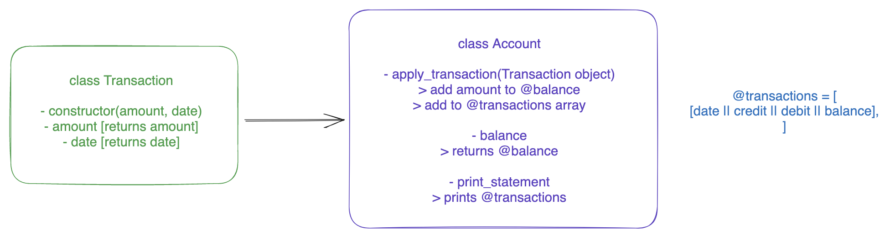

# Bank tech test

## Installation

Welcome to my Bank tech test. To install my code and ensure you can run rspec, rubocop, and view my test coverage, make sure to clone this repo and run the following command:

```
bundle install
```

You can then run `rspec` and notice that all tests are passing, and that my code coverage is 100%. You can also run `rubocop` to see that I have no rubocop offenses. Please note that in the _.rubocop.yml_ file, I have added some exclusions I deemed necessary. This includes not checking the spec files for code length, and avoid running rubocop on the spec_helper and Gemfile documents. I did have an issue with enforcing `apply_deposit` to use a deposit object and similarly for `apply_withdrawal`, as I couldn't successfully mock the deposit/withdrawal object to pass the `is_a?` fail line in my account unit test.

## Process

Below is the diagram I fleshed out before diving into the code:


My approach was to have an object for each transaction, separated into a deposit or a withdrawal, which both work the same. Once they are applied to the account object, that is when they differ slightly, with deposits adding to the balance and creating a credit, and withdrawals subtracting from the balance and creating a debit. I could have had simply one transaction class that could then have been applied to the correct method in account, but for clarity, I wanted to ensure the user knew what kind of transaction object they created. Instead of having
```
account = Account.new
transaction = Transaction.new(1000, '01/01/2023')
account.apply_deposit(transaction)
```

I believe the following causes less confusion from the get-go:
```
account = Account.new
deposit = Deposit.new(1000, '01/01/2023')
account.apply_deposit(deposit)
```

I have the `apply_deposit` and `apply_withdrawal` to add to/subtract from the `@balance` depending on the method, and added a string to the `@transactions` array with the right credit/debit formatting to make it easier later in the `print_statement` method. As I was going through the self-assessment, I realized I could refactor some bits and remove redundant code, such as adding to a `@deposists` and a `@withdrawals` array that I didn't need to use in the end. One may notice the funny `format('%.2f'` syntax - this is to ensure amounts are shown to 2 decimal places. In the deposit and withdrawal classes, I'm forcing the amount to be an integer for simplicity, and then converting the format esthetically once added to an account. Perhaps I could take more time researching a good data type for money that's not an integer so I don't need to reformat it later in account to 2 decimal places. Similar thing for picking a good variable for date to not be a string as my code doesn't currently enforce a format when entering it.

## Running the code on IRB
In order to run the code and play around with it, run the following on your terminal:

```
irb -r './lib/account.rb' -r './lib/deposit.rb' -r './lib/withdrawal.rb'
```

From there, you can create a new `account` obejct. When creating a new `deposit` or `withdrawal` object, make sure to include an integer as the amount for the first argument, and the date as a string in the second argument, in the format that you'd like. You must then use the `apply_deposit` and `apply_withdrawal` on the `account` to apply the `deposit` or `withdrawal` object, respectively. Here is an example:


Thank you for reading and please let me know if you have any feedback :)